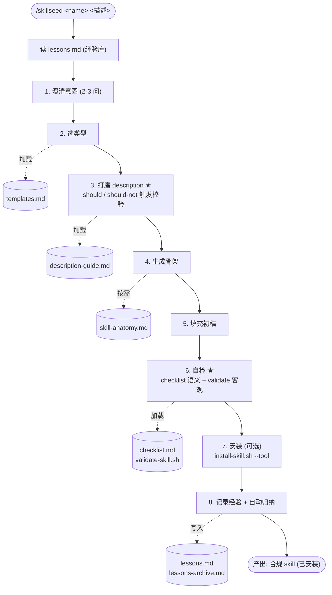
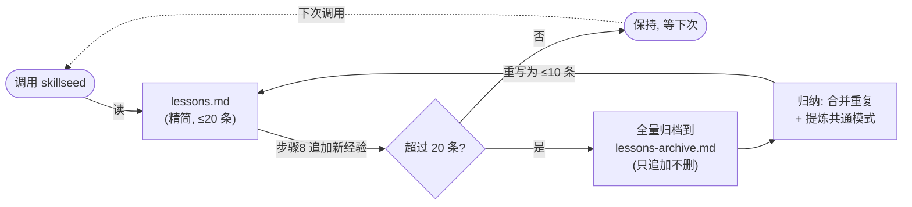

# SkillSeed

<p align="center">
  
</p>

> Build **Agent Skills** that work across Claude Code, Codex, Cursor, and more — SkillSeed scaffolds them, validates they trigger, and learns from every one.

**SkillSeed** is a meta-skill (`skillseed`) that scaffolds [Agent Skills](https://agentskills.io) end-to-end. It's more than a file generator — it's a **skill-writing coach** that checks whether your skill will actually trigger, validates it against the format spec, and **learns from every skill you create** via a built-in experience log. Generated skills follow the open standard, so the same skill works in Claude Code, Codex, Cursor, Gemini CLI, and any compatible tool.

## Why SkillSeed?

Most agents can already write a `SKILL.md` on their own. So SkillSeed earns its place by doing what raw generation doesn't:

- **Trigger validation** — the #1 skill failure mode is *"written fine, but the agent never auto-triggers it"*. SkillSeed forces 6 boundary cases (3 should-trigger + 3 should-not-trigger) and tightens the description until they pass.
- **Conformance self-check** — no silent failures from name casing, oversized descriptions, references that chain-load each other, or 500+ line SKILL.md.
- **Self-improving experience log** — every skill you create appends a lesson to `lessons.md`; next time, SkillSeed reads it first. **The rules never drift; only the memory grows.**
- **Cross-tool by default** — one skill, many agents. Install the same skill to Claude Code, Codex, or Cursor with a single flag.
- **Living examples** — `skillseed` itself is a spec-compliant skill; `processing-pdfs` is one it generated. Read them to learn the craft.

## What you can do with it

- **Scaffold a new skill in minutes** — `/skillseed <name> "<one-line description>"`
- **Learn skill best practices** — read `skill-anatomy.md` + study the two example skills
- **Use as your skill repo starting point** — fork, drop your skills into `skills/`, install with the script
- **Target any agent** — install the same skill to Claude Code, Codex, or Cursor (or all of them)

## Quick start

```bash
git clone https://github.com/ht426/skillseed.git SkillSeed && cd SkillSeed

# Install skillseed into a tool (default: claude)
bash scripts/install-skill.sh skillseed --tool claude --project
# same skill, other tools:
bash scripts/install-skill.sh skillseed --tool codex --user
bash scripts/install-skill.sh skillseed --tool cursor --project

# restart the target tool once (first time creates its skills dir), then:
/skillseed processing-pdfs "extract tables and text from PDF invoices"
```

---

# SkillSeed（中文文档）

一个 **Agent Skills 仓库**: 基于 [Agent Skills 开放标准](https://agentskills.io), 生成的 skill 兼容 Claude Code、Codex、Cursor、Gemini CLI 等工具。内置 `skillseed` —— 一个帮你创建其他 skill 的 meta-skill。

## 为什么用 SkillSeed（核心优势）

多数 agent 原生就能生成 SKILL.md。所以 SkillSeed 不靠"生成文件"取胜, 而靠这些**原生做不到**的增值:

1. **触发校验** —— skill 最常见的死法是"写好了, 但 agent 从不自动触发"。SkillSeed 强制跑 6 个边界案例 (3 个该触发 + 3 个不该触发), 据此收紧 description。
2. **合规自检** —— 不会因 name 大小写、description 超 1024 字符、references 互相引用、SKILL.md 超 500 行等问题静默失效。
3. **越用越聪明的经验库** —— 每次创建 skill 自动往 `lessons.md` 追加反思, 下次调用先读它。**规范文件不动, 只长记性。**
4. **跨工具原生支持** —— 一份 skill, 多个 agent。一条命令装到 Claude Code、Codex 或 Cursor。
5. **自带活教材** —— `skillseed` 自己是合规 skill, `processing-pdfs` 是它的产物。读这两个就能学到最佳实践。

## 你能用它来干嘛

| 场景 | 怎么用 |
|------|--------|
| 快速脚手架新 skill | `/skillseed <名字> "<一句话描述>"` → 几分钟出合规骨架 |
| 学 skill 最佳实践 | 读 `skill-anatomy.md` 规范 + 看 skillseed / processing-pdfs 两个实例 |
| 当自己的 skill 仓库起点 | fork 仓库, 把你的 skill 放进 `skills/`, 用安装脚本管理 |
| 面向任意 agent | 同一 skill 装到 Claude Code、Codex、Cursor (或全部) |

## 适合谁

- 想给 AI agent 写 skill 但不知从哪下手的人
- 已有多个 skill、想集中管理 + 一键安装到不同工具的人
- 想学 Agent Skills 设计的人

## 快速开始

```bash
# 安装 skillseed 到某工具 (默认 claude)
bash scripts/install-skill.sh skillseed --tool claude --project
# 同一份 skill, 装到其他工具:
bash scripts/install-skill.sh skillseed --tool codex --user
bash scripts/install-skill.sh skillseed --tool cursor --project

# 重启目标工具一次, 然后:
/skillseed
# 或带参数跳过提问:
/skillseed processing-pdfs "extract tables from PDF invoices"
```

## skillseed 的工作流

调用后走 8 步 (带参跳过第 1 步)。★ 为核心增值点, 虚线为该步按需加载的 reference (渐进式披露):



设计要点: **渐进式披露** —— references 不一开始全读, 每步按需加载 (图中虚线), 省 token、聚焦当前步骤。

## 仓库结构

```
SkillSeed/
├── CLAUDE.md                       # 给在仓库内工作的 agent 的指引
├── README.md
├── LICENSE
├── scripts/
│   ├── install-skill.sh            # 安装工具: canonical → 各工具 skills 目录
│   └── validate-skill.sh           # 客观校验: skill 的机械合规项
├── skills/                         # canonical 源 (进 git)
│   ├── skillseed/                  # meta-skill: 造 skill 的 skill
│   │   ├── SKILL.md
│   │   └── references/
│   │       ├── lessons.md          # 经验库 (进化, 运行时累积)
│   │       ├── templates.md        # 3 种骨架模板
│   │       ├── description-guide.md # 触发描述指南
│   │       ├── skill-anatomy.md    # 完整格式规范 (含多工具路径)
│   │       └── checklist.md        # 自检清单
│   └── processing-pdfs/            # skillseed 的首个产物 (实例)
│       ├── SKILL.md
│       └── references/
│           └── extraction-tools.md
└── .claude/skills/                 # 安装副本 (各工具从自己的 skills 目录发现)
```

**两个区域**: `skills/` 是 canonical 源 (开发 + 版本管理); 各工具的 skills 目录 (如 `.claude/skills/`、`~/.agents/skills/`、`.cursor/skills/`) 是运行副本, 由 install-skill.sh 生成。

## 安装一个 skill

```bash
bash scripts/install-skill.sh <name> --tool <claude|codex|cursor> [--user|--project] [--target <path>] [--force]
```

| 参数 | 作用 |
|------|------|
| `<name>` | `skills/` 下的 skill 目录名 |
| `--tool <t>` | 目标工具: claude / codex / cursor (默认 claude) |
| `--user` | 装到该工具的全局 skills 目录 (如 `~/.claude/skills/`) |
| `--project` | 装到该工具的项目 skills 目录 (如 `.claude/skills/`, 默认) |
| `--target <path>` | 自定义 skills 根目录 (覆盖 --tool 的默认路径) |
| `--force` | 覆盖已存在的目标 |

各工具默认路径:

| 工具 | 全局 (`--user`) | 项目 (`--project`) |
|------|----------------|-------------------|
| Claude Code | `~/.claude/skills/` | `.claude/skills/` |
| Codex | `~/.agents/skills/` | `.agents/skills/` |
| Cursor | `~/.cursor/skills/` | `.cursor/skills/` |

> 路径基于各工具公开文档 (2026), 可能随版本变化; 不确定时用 `--target <path>` 指定。

**重启提示**: 首次创建某工具的 skills 根目录需**重启该工具**才能被发现; 之后对已存在 SKILL.md 的编辑会被实时检测。

## 经验库 (进化机制)

skillseed 维护**两个**经验文件:
- `lessons.md` —— 当前精简经验。每次创建完 skill 追加一条反思 (步骤 8); 调用 skillseed 时先读它。
- `lessons-archive.md` —— 原始全量档案。归纳时把 lessons.md 的条目归档到这里, 只追加不删。

**自动归纳**: 当 lessons.md 超过 20 条, 步骤 8 自动归纳 —— 合并重复 + 提炼共通模式, lessons.md 重写为精简版 (≤10 条), 原始全量保留在 archive。既归纳又不丢历史。



**经验库是运行时状态**:
- 写在安装副本 (如 `.claude/skills/skillseed/references/`), 不进 canonical 源。
- 重装时 install-skill.sh **自动保留** lessons.md 和 lessons-archive.md, 不覆盖。
- 若某条经验足够通用想纳入规范, 手动提炼进 checklist/templates 等 canonical 文件。

## 开发 skillseed 自身

canonical 源在 `skills/skillseed/`。改完后重装:

```bash
bash scripts/install-skill.sh skillseed --tool claude --project
```

- 首次安装需重启一次 (创建该工具的 skills 目录)。
- 之后重装无需重启: SKILL.md 变更实时生效, references 每次调用重读。
- 纯复制, 无符号链接 (Windows 友好)。改了 canonical 源务必重装。
- 经验库 `lessons.md` 重装自动保留。

## 与官方 skill-creator 插件的关系

两者互补:
- **SkillSeed**: 脚手架 + 写作教练 + 合规自检 + 跨工具安装 + 经验库进化。
- **官方插件** (`/plugin install skill-creator@claude-plugins-official`): Claude Code 专属, eval / iterate, 批量测触发命中率, A/B 对比版本。

SkillSeed 生成的 skill 跨工具通用; 官方插件专注 Claude Code 内的评估迭代。

## 已知局限 (诚实说明)

- SkillSeed 是一个**精心设计的起点 / 模板**, 不是成熟产品 —— 目前只在 Claude Code 上实测过 (processing-pdfs)。Codex / Cursor 的安装路径基于公开文档, 未逐一实测。
- 自动归纳依赖 Claude 的语义理解 —— 合并/提炼质量取决于调用上下文; 归纳后建议人工扫一眼 archive 确认没丢重要经验。

## 语言策略
- frontmatter `description`: **中文**。
- 正文 / references: **中文**。
- description-guide 中保留部分英文真实 skill 示例供结构参考。
